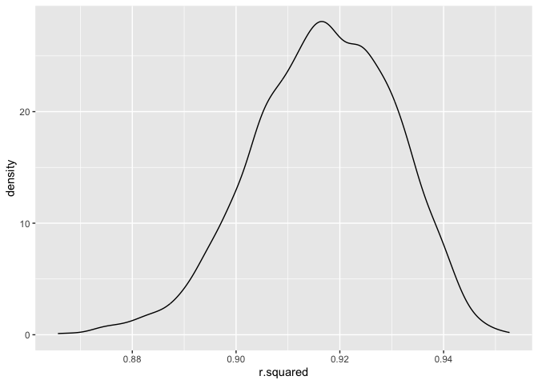
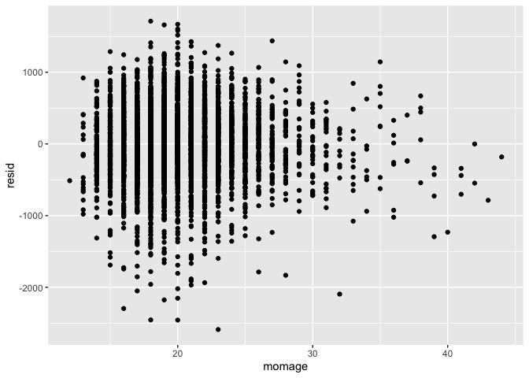

p8105_hw6_wz2675
================
Wenyu Zhang
2023-12-01

# Problem 1

``` r
homicide_df = 
  read_csv("data/homicide-data.csv", na = c("", "NA", "Unknown")) |> 
  mutate(
    city_state = str_c(city, state, sep = ", "),
    victim_age = as.numeric(victim_age),
    resolution = case_when(
      disposition == "Closed without arrest" ~ 0,
      disposition == "Open/No arrest"        ~ 0,
      disposition == "Closed by arrest"      ~ 1)
  ) |> 
  filter(victim_race %in% c("White", "Black")) |> 
  filter(!(city_state %in% c("Tulsa, AL", "Dallas, TX", "Phoenix, AZ", "Kansas City, MO"))) |> 
  select(city_state, resolution, victim_age, victim_sex, victim_race)
```

    ## Rows: 52179 Columns: 12
    ## ── Column specification ────────────────────────────────────────────────────────
    ## Delimiter: ","
    ## chr (8): uid, victim_last, victim_first, victim_race, victim_sex, city, stat...
    ## dbl (4): reported_date, victim_age, lat, lon
    ## 
    ## ℹ Use `spec()` to retrieve the full column specification for this data.
    ## ℹ Specify the column types or set `show_col_types = FALSE` to quiet this message.

``` r
baltimore_glm = 
  filter(homicide_df, city_state == "Baltimore, MD") |> 
  glm(resolution ~ victim_age + victim_sex + victim_race, family = binomial(), data = _)

baltimore_glm |> 
  broom::tidy() |> 
  mutate(
    OR = exp(estimate), 
    OR_CI_upper = exp(estimate + 1.96 * std.error),
    OR_CI_lower = exp(estimate - 1.96 * std.error)) |> 
  filter(term == "victim_sexMale") |> 
  select(OR, OR_CI_lower, OR_CI_upper) |>
  knitr::kable(digits = 3)
```

|    OR | OR_CI_lower | OR_CI_upper |
|------:|------------:|------------:|
| 0.426 |       0.325 |       0.558 |

``` r
model_results = 
  homicide_df |> 
  nest(data = -city_state) |> 
  mutate(
    models = map(data, \(df) glm(resolution ~ victim_age + victim_sex + victim_race, 
                             family = binomial(), data = df)),
    tidy_models = map(models, broom::tidy)) |> 
  select(-models, -data) |> 
  unnest(cols = tidy_models) |> 
  mutate(
    OR = exp(estimate), 
    OR_CI_upper = exp(estimate + 1.96 * std.error),
    OR_CI_lower = exp(estimate - 1.96 * std.error)) |> 
  filter(term == "victim_sexMale") |> 
  select(city_state, OR, OR_CI_lower, OR_CI_upper)

model_results |>
  slice(1:5) |> 
  knitr::kable(digits = 3)
```

| city_state      |    OR | OR_CI_lower | OR_CI_upper |
|:----------------|------:|------------:|------------:|
| Albuquerque, NM | 1.767 |       0.831 |       3.761 |
| Atlanta, GA     | 1.000 |       0.684 |       1.463 |
| Baltimore, MD   | 0.426 |       0.325 |       0.558 |
| Baton Rouge, LA | 0.381 |       0.209 |       0.695 |
| Birmingham, AL  | 0.870 |       0.574 |       1.318 |

``` r
model_results |> 
  mutate(city_state = fct_reorder(city_state, OR)) |> 
  ggplot(aes(x = city_state, y = OR)) + 
  geom_point() + 
  geom_errorbar(aes(ymin = OR_CI_lower, ymax = OR_CI_upper)) + 
  theme(axis.text.x = element_text(angle = 90, hjust = 1))
```

<!-- -->

# Problem 2

``` r
weather_df = 
  rnoaa::meteo_pull_monitors(
    c("USW00094728"),
    var = c("PRCP", "TMIN", "TMAX"), 
    date_min = "2022-01-01",
    date_max = "2022-12-31") |>
  mutate(
    name = recode(id, USW00094728 = "CentralPark_NY"),
    tmin = tmin / 10,
    tmax = tmax / 10) |>
  select(name, id, everything())
```

    ## using cached file: /Users/avallenche/Library/Caches/org.R-project.R/R/rnoaa/noaa_ghcnd/USW00094728.dly

    ## date created (size, mb): 2023-11-30 20:03:44.356429 (8.544)

    ## file min/max dates: 1869-01-01 / 2023-11-30

``` r
r_squared_boot = 
  weather_df |> 
  select(prcp, tmax, tmin) |> 
  bootstrap(n = 5000) |> 
  mutate(
    models = map(strap, \(df) lm(tmax ~ prcp + tmin, data = df)),
    results = map(models, broom::glance)) |> 
  select(-strap, -models) |> 
  unnest(results)
```

``` r
r_squared_boot |> 
  ggplot(aes(x = r.squared)) + geom_density()
```

<!-- -->

From the given plot we have made, the distribution is slightly skewed to
the left (a heavy tail extending to low values) and a bit of a
“shoulder”, features that may be related to the frequency with large
outliers are included in the bootstrap sample.

``` r
quantile(r_squared_boot$r.squared, c(0.025, 0.975), na.rm = TRUE)
```

    ##      2.5%     97.5% 
    ## 0.8885495 0.9406812

``` r
beta_log_boot = 
  weather_df |> 
  select(prcp, tmax, tmin) |> 
  bootstrap(n = 5000) |> 
  mutate(
    models = map(strap, \(df) lm(tmax ~ prcp + tmin, data = df)),
    results = map(models, broom::tidy)) |> 
  select(-strap, -models) |> 
  unnest(results) |> 
  select(.id, term, estimate) |> 
  pivot_wider(names_from = term, values_from = estimate) |> 
  mutate(log_beta1_beta2 = log(prcp * tmin))
```

    ## Warning: There was 1 warning in `mutate()`.
    ## ℹ In argument: `log_beta1_beta2 = log(prcp * tmin)`.
    ## Caused by warning in `log()`:
    ## ! NaNs produced

``` r
beta_log_boot |> 
  ggplot(aes(x = log_beta1_beta2)) + geom_density()
```

    ## Warning: Removed 3304 rows containing non-finite values (`stat_density()`).

<!-- -->

From the graph we made, the pattern of the distribution is shown as a
obvious left-skewed distribution with a slight “shoulder”. This
indicates that there are multiple outliers in small value of the
bootstrap appears and form this kind of distribution.

``` r
quantile(beta_log_boot$log_beta1_beta2, c(0.025, 0.975), na.rm = TRUE)
```

    ##      2.5%     97.5% 
    ## -8.884759 -4.603985

# Problem 3

``` r
birthweight = 
  read_csv("./data/birthweight.csv") |> 
  mutate(babysex = as.factor(ifelse(babysex == 1, "male", "female")),
         frace = as.factor(case_when(
           frace == 1 ~ "White",
           frace == 2 ~ "Black",
           frace == 3 ~ "Asian",
           frace == 4 ~ "Puerto Rican",
           frace == 8 ~ "Other",
           frace == 9 ~ "Unknown")),
         malform = as.factor(ifelse(malform == 0, "absent", "present")),
         mrace = as.factor(case_when(
           mrace == 1 ~ "White",
           mrace == 2 ~ "Black",
           mrace == 3 ~ "Asian",
           mrace == 4 ~ "Puerto Rican",
           mrace == 8 ~ "Other"
         ))
   )
```

    ## Rows: 4342 Columns: 20
    ## ── Column specification ────────────────────────────────────────────────────────
    ## Delimiter: ","
    ## dbl (20): babysex, bhead, blength, bwt, delwt, fincome, frace, gaweeks, malf...
    ## 
    ## ℹ Use `spec()` to retrieve the full column specification for this data.
    ## ℹ Specify the column types or set `show_col_types = FALSE` to quiet this message.

``` r
my_lm = lm(bwt ~ fincome * menarche + fincome * momage + menarche * momage, data = birthweight)
my_lm |> 
  broom::tidy() |> 
  select(term, estimate,p.value) |> 
  knitr::kable(digit = 3)
```

| term             | estimate | p.value |
|:-----------------|---------:|--------:|
| (Intercept)      | 2448.254 |   0.000 |
| fincome          |    1.424 |   0.626 |
| menarche         |   20.765 |   0.415 |
| momage           |   39.487 |   0.019 |
| fincome:menarche |    0.101 |   0.631 |
| fincome:momage   |   -0.016 |   0.837 |
| menarche:momage  |   -1.957 |   0.127 |

``` r
birthweight |> 
  add_residuals(my_lm) |> 
  ggplot(aes(x = momage, y = resid)) + geom_point()
```

<!-- -->

The modeling of my linear model is inspired by the relation between
mom’s body condition - `momage` & `menarche` and family income
condition - `fincome` verses the `birthweight` of the baby. So, I
created a three-way multiple linear regression model to find out whether
the model are sufficient enough for finding a pattern for our dependent
value - `birthweight`. According to our residual plot, it seems that the
distribution are not good enough since all the points are tends to
cluster to the left, which is not a good residual distribution. So, the
model needs improvement.

``` r
cv_df = 
  crossv_mc(birthweight, 100) |> 
  mutate(
    train = map(train, as_tibble),
    test = map(test, as_tibble))
cv_df = 
  cv_df |> 
  mutate(
    linear_mod = map(train, \(df) lm(bwt ~ blength + gaweeks, data = df)),
    pwl_mod = map(train, \(df) lm(bwt ~ bhead * blength + bhead * babysex + blength * babysex, data = df)),
    mypwl_mod = map(train, \(df) lm(bwt ~ fincome * menarche + fincome * momage + menarche * momage, data = df))) |> 
  mutate(
    rmse_linear = map2_dbl(linear_mod, test, \(mod,df) rmse(model = mod, data = df)),
    rmse_pwl = map2_dbl(pwl_mod, test, \(mod,df) rmse(model = mod, data = df)),
    rmse_mypwl = map2_dbl(mypwl_mod, test, \(mod,df) rmse(model = mod, data = df))
  )
cv_df |> 
  select(starts_with("rmse")) |> 
  pivot_longer(
    everything(),
    names_to = "model",
    values_to = "rmse",
    names_prefix = "rmse_") |> 
  mutate(model = fct_inorder(model)) |> 
  ggplot(aes(x = model, y = rmse)) + geom_violin()
```

<!-- -->
